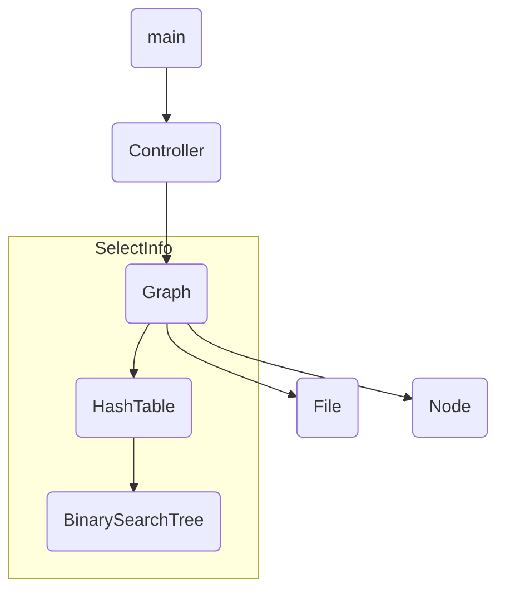

# 2020NjuDataStructureProject
本项目为南京大学2020年暑期数据结构的期末项目

项目模块划分如下：

- **main**：程序运行的入口
- **controller**：负责程序的流程控制，根据用户的不同输入采取调用不同的行为
- **graph**：图模块，包括图类的定义和项目各种功能的定义
- **file**：从文件中以不同的方式读取数据，提供按流读取和按行读取两种方式
- **g_distance**：完成求两结点间最短路径的功能，具体的实现：
  - 快速计算：在程序初始化时调用沃舍尔算法计算，在查询时直接查找给出结果
  - 及时计算：采用贝尔曼-福特算法及时计算，给出完整的路线
- **g_paint**：采用回溯算法完成图染色的功能
- **g_selectionInfo**：使用二叉搜索树进行数据的查询
- **g_plan**：采用克鲁斯卡尔算法进行最小生成树的计算，从而输出结果
- **node**：结点数据类型，存储了一个结点有关的相应信息

