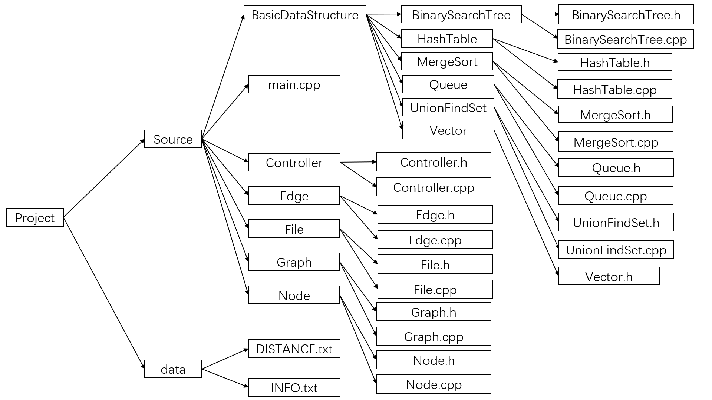

# 2020 Nju DataStructure Project
本项目为南京大学2020年暑期数据结构的期末项目

本项目未直接使用助教提供的`距离.txt` 和 `省邻接关系.txt`数据，而是通过代码对助教提供的数据进行结构上的调整从而得到了新的 `data/DISTANCE.txt` ，并且通过自行检索获得了 `data/INFO.txt`文件，由于调整行政区域数据的结构的代码并未在项目中起到其他作用，因此不添加进项目中。

- 项目的具体要求见：`docs/Instruction.pdf`

- 项目的模块设计与划分见：`docs/Design.md`
- 项目的使用样例见：`docs/UserManual.md`
- 项目的性能测试结果见：`docs/Test.md`

对本项目由任何疑问可发送邮件至 kecheng.nju@gmail.com 与我联系

## 项目功能

本项目用无向图对中国行政区域图进行建模， 支持对地图的基本信息查询、染色和最短路径求解等功能。

具体支持功能如下：

- 打印行政区域列表：打印出所有支持的行政区域名称
- 查询行政区域信息：输出行政区域名称，返回行政区域信息
- 对区域进行染色：使用 `red,yellow,bule,green` 四种颜色对图进行染色
- 建立通信网：根据省邻接数据应，应用克鲁斯卡尔算法生成最小生成树并返回最小生成树边的总长度
- 查询行政区域距离：输入两个**不同**的行政区域名称，返回他们之间的距离和路线。P.S.如果输入相同的行政区域名称，那么返回的距离为0
- 退出程序

## 项目文件结构

项目文件结构如下图所示：

