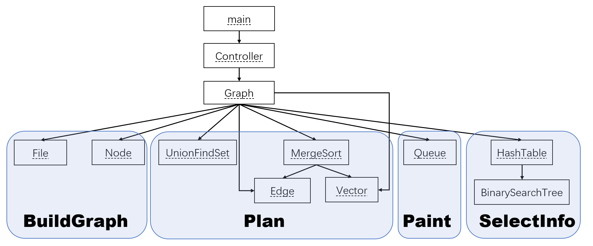
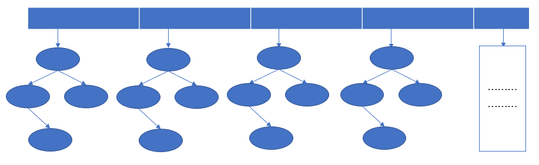
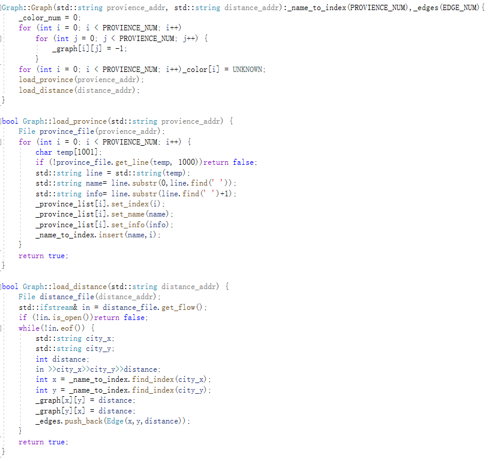
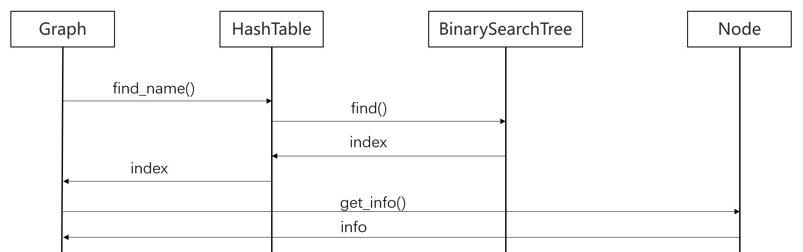
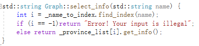
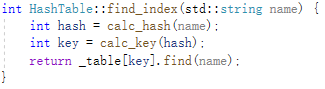
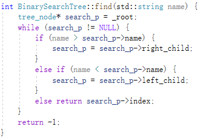
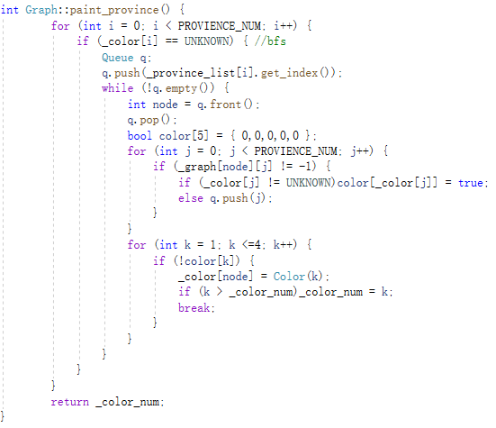
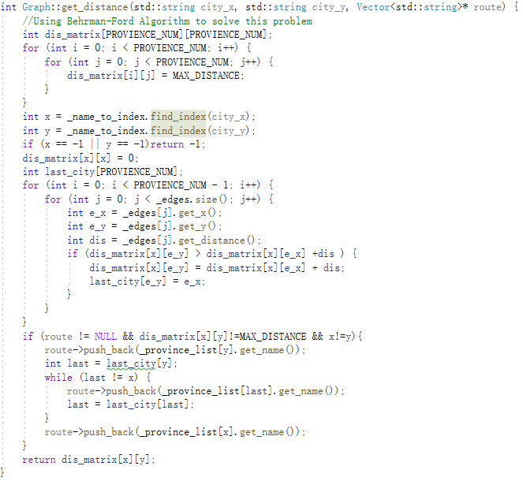
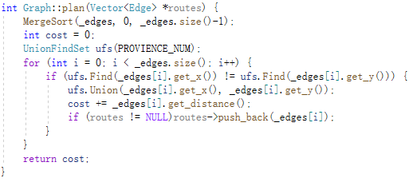

## 设计框架

###### 本项目共12个模块，划分如下：

**mian**：主模块，是程序的入口

**Controller**：控制模块，根据用户的不同输入调用 `Graph` 的不同方法，并进行相应信息的输出

**Graph**：图模块，关于图所有的功能都在这里实现，其中包括 `BuildGraph`，`SelectInfo`，`Distance`，`Plan`和 `PaintGraph`

**File**：文件模块，从文件中读取相关信息的模块，提供了按流读取`get_flow`和按行读取`get_line`两种方式，在`Graph` 中用来从数据文件中读取数据生成图结构

**Node**：结点模块，图中结点(行政区域)的数据结构，其中包括 `_index`，`_name`，`_info` 三个数据成员，分别是行政区域编号，行政区域名，行政区域详细信息

**Edge**：边模块，图中边的数据结构，其中包括 `_city_x`，`_city_y`，`_distance` 三个数据成员，分别是边的两个端点城市和两个城市之间的距离。在 `Plan` 功能实现的过程中，需要提供**边**结构 

**Vector**：向量模块，顺序数组类模板，用来在图中存储边结构。

**UnionFindSet**：并查集模块，用在 `Plan` 功能的实现中

**MergeSort**：归并排序模块，用在 `Plan` 功能的实现中

**Queue**：队列模块，用在`Paint` 功能的实现中，为 `bfs` 提供了存储结点的容器

**HashTable**：哈希表模块，用在`SelectInfo` 功能的实现中，通过**行政区名**检索**行政区编号**，其采用链式开散列实现，每个“桶”都是一个`BST`，极大的提高了检索的效率，具体结构如下：

**BinarySearchTree**：二分查找树，用来作为 `HashTable` 每一个“桶”的数据结构

## 功能实现

###### 本项目主要功能的实现方法如下：

- **BuildGraph**：

  - 实现：
    - 从 `INFO.txt` 文件中读取省名称和省详细信息，存储到`Graph`的数据成员 `_provience_list` 中，并初始化数据成员哈希表 `_name_to_index`
    - 从`DISTANCE.txt` 中读取相邻行政区域之间的距离，并初始化数据成员距离矩阵 `_graph` 和边集 `_edges`

  - 具体代码如下：设结点个数为$n$，边条数为 $m$ ，那么BuildGraph的总**时间复杂度**为 $O(n+m)$

  

- **SelectInfo**：

  - 实现：通过哈希表 `_name_to_index`获取输入行政区对应的编号，根据编号从 `_provience_list` 中取出相应的信息，调用流如下：

    

  - 具体代码如下：

    - `select_info` ，时间复杂度同 `find_index`

      

    - `find_index`，时间复杂度为同 `find`

      

    - `find`，设n为一棵BST中结点的个数，平均**时间复杂度**为 $O(logn)$，最坏情况下为 $O(n)$

      

  

- **PaintGraph**：

  - 实现：采用广度优先搜索`(bfs)`实现，在算法运行的过程中采用 `Queue` 作为存放边的容器，具体实现见 `Graph.cpp` 中的`paint_province()` 方法

  - 具体代码如下：设图的顶点数为 $n$，边数为 $m$，**时间复杂度**为 $O(m+n)$

    

- **Distance**：

  - 实现：采用贝尔曼-福特算法实现，具体实现见 `Graph.cpp` 中的`get_distance()` 方法

  - 具体代码如下：设图中顶点个数为$n$，边数为 $m$，算法的**时间复杂度**为 $O(nm)$

    

- **Plan**：
  - 实现：采用克鲁斯卡尔算法实现，先使用 `MergeSort` 对边集排序，在算法运行的过程中使用 `UnionFindSet` 检查是否成环。具体实现见 `Graph.cpp` 中的`plan()` 方法
  
  - 具体代码如下：设图的边数为 $m$，算法的时间复杂度为$O(mlogm)$
  
    

