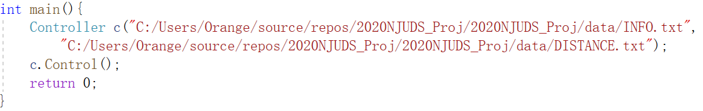
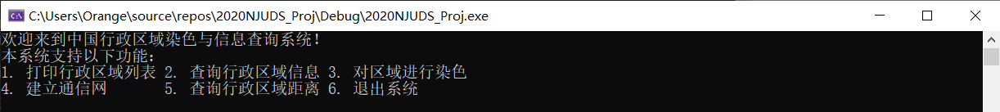
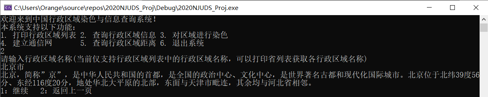
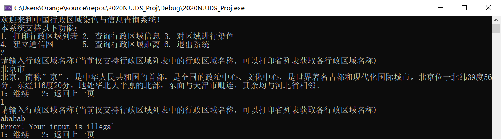
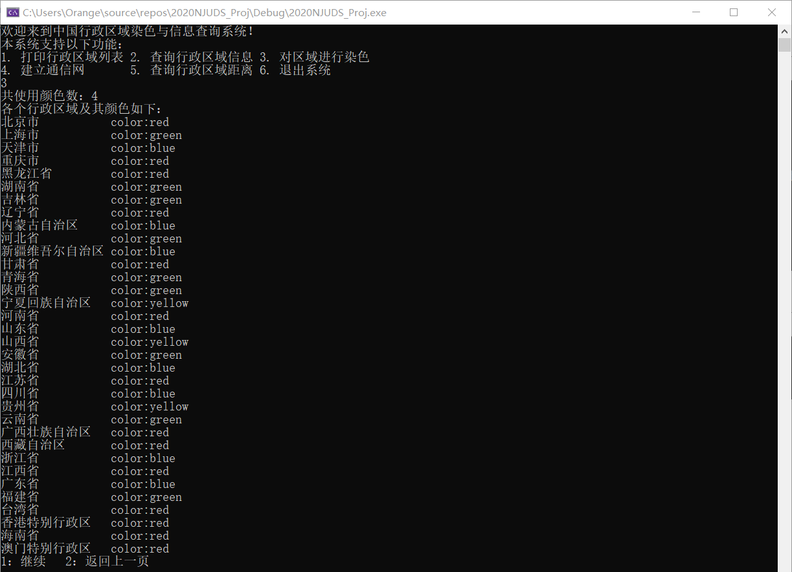
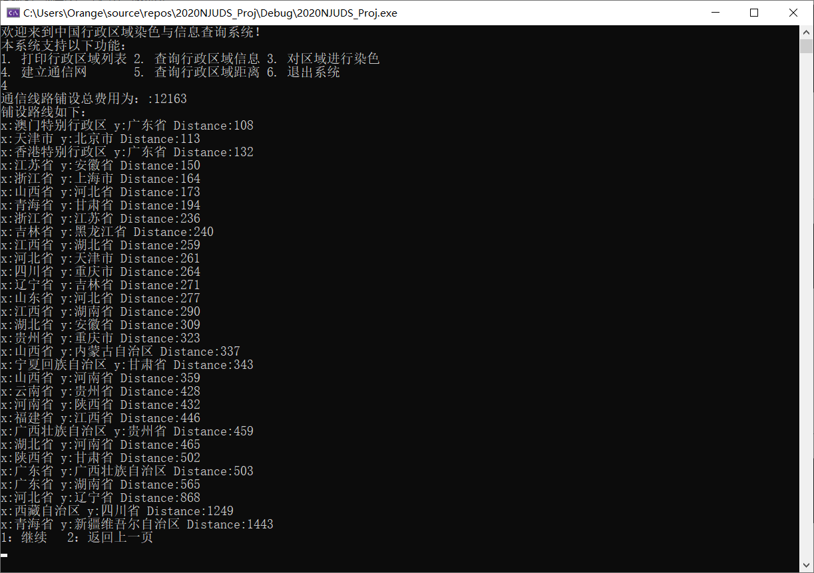
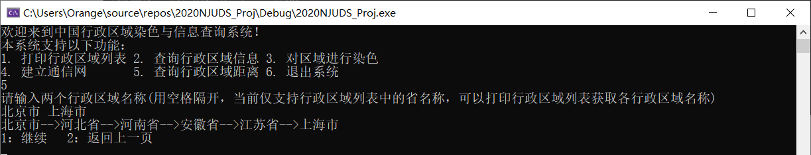
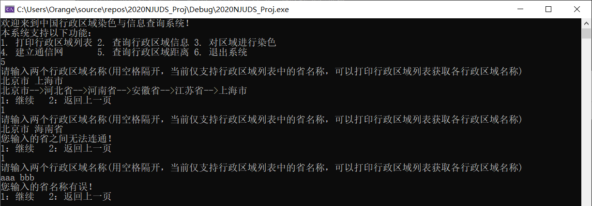
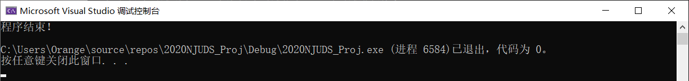

## 用户手册

#### 0. 注意事项

在程序运行前请**一定保证**文件路径填写正确，否则将无法正确运行！

请使用**绝对路径**，可以在 `main.cpp`  中修改文件路径

#### 1. 运行程序

程序运行的初始界面如下，在这里你可以选择不同的操作

#### 2. 查询行政区域信息

在初始界面下输入 `2` ，可以进行查询行政区域信息操作，当前**仅支持对行政区域列表中存在的区域进行查询**，输入 `北京市` 得到的输出如下图所示：

选择 `1`，继续查询：

输入乱码，返回错误信息

选择`2`，返回主页面

#### 3. 对区域进行染色

输入`3`，对区域进行染色

共有 `red,blue,green,yellow` 四种颜色

如下图所示：输出了共使用的颜色数 为4以及各个行政区的颜色

输入`2` 返回上一页

#### 4. 建立通信网

输入`4` 建立通信网

如下图所示，输出了建立通信网所需要的总费用，网络中的边以及每条边的长度

输入`2` 返回上一页

#### 5. 查询行政区域距离

输入`5 ` 查询行政区域距离

输入 `北京市 上海市`，如下图所示，输出了北京市到上海市的距离以及路线

输入`1`，继续查询，输入 `北京市 海南省` ，因为海南省未与任何省相邻，所以不可达

输入1，继续查询，输入乱码 `aaa bbb`，提示输入有误

输入`2` 返回上一页

#### 6. 退出程序

输入`6` 退出程序

